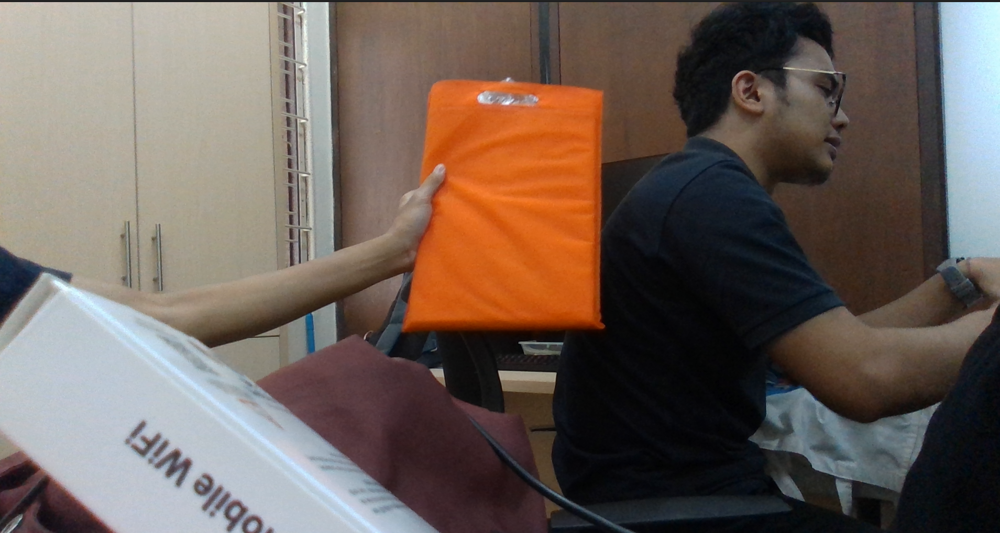
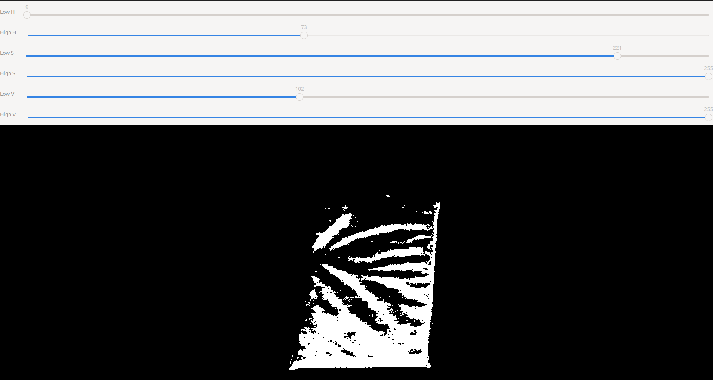

# MSD700 'Follower' Package
This document is the reference to install the Follower project for kernel 5.10.0.88-generic (usually PC with Ubuntu dual boot)

## Prerequisite

1. Installed [ROS](http://wiki.ros.org/ROS/Installation). In this project, we use [ROS Noetic](http://wiki.ros.org/noetic/Installation) distribution.
2. Installed [rosserial_arduino](http://wiki.ros.org/rosserial_arduino). With this package we can connect our machine with Arduino and communicate with it using ROS.
3. Installed [Git](https://git-scm.com/downloads).

## Instal `rosserial_arduino`

If you haven't installed `rosserial_arduino`, here are the step to install it.  
Open the terminal and run the following command.
```bash
sudo apt-get install ros-$ROS_DISTRO-rosserial-arduino
sudo apt-get install ros-$ROS_DISTRO-rosserial
```
For our development, because we use ROS Noetic the command that we use are 
```bash
sudo apt-get install ros-noetic-rosserial-arduino
sudo apt-get install ros-noetic-rosserial
```
  
After installing `rosserial` for our machine, we installed `rosserial` arduino library. 
1. Open the Arduino IDE, in this case we use Arduino IDE 1.8.19 but this may work in other version as well.
2. Open **Sketch** tab then select **Include Library** and click **Manage Libraries**.
3. This will open **Library Manager** Window. Search for **rosserial** and install the library.


# How to Use

## 1. Setup the ROS Package

1. Go to your local ROS workspace. For example:
``` bash
cd ~/catkin_ws/src
```
2. Clone the repository.
``` bash
git clone https://github.com/itbdelaboprogramming/follower.git
```
3. Go to
```bash
cd ~/catkin_ws
```
4. Make the ROS workspace, type `catkin_make` into the terminal and run it.
``` bash
catkin_make
```

## 2. Setup the Arduino Board

1. Run the ROS Environment.
``` bash
roscore
```
2. Go to your Arduino libraries directory and remove the ros_lib folder if it already exist.
``` bash
cd <sketchbook>/libraries
rm -rf ros_lib
```
3. Open a new terminal an create a new ros_lib. A new folder named `ros_lib` should appear in your Arduino Libraries directory.
``` bash
rosrun rosserial_arduino make_libraries.py .
```
4. Go back to the `follower` directory and go to the Arduino folder.
``` bash
cd ~/catkin_ws/src/follower/arduino/test_custom_ros_msg
```
5. Open the Arduino sketch with Arduino IDE and upload it to your board.
``` bash
arduino test_custom_ros_msg
```

## 3. Install the Intel RealSense SDK 2.0

1. Register the server's public key.
``` bash
sudo apt-key adv --keyserver keyserver.ubuntu.com --recv-key F6E65AC044F831AC80A06380C8B3A55A6F3EFCDE || sudo apt-key adv --keyserver hkp://keyserver.ubuntu.com:80 --recv-key F6E65AC044F831AC80A06380C8B3A55A6F3EFCDE
````
2. Add the server to the list of repositories.
```bash
sudo add-apt-repository "deb https://librealsense.intel.com/Debian/apt-repo $(lsb_release -cs) main" -u
```
3. Install the SDK libraries.
```bash
sudo apt-get install librealsense2-dkms
sudo apt-get install librealsense2-dev
```
The above two lines will deploy librealsense2 udev rules, build and activate kernel modules, runtime library and executable demos and tools.
4. Install the developer and debug packages.
```bash
sudo apt-get install librealsense2-dev
sudo apt-get install librealsense2-dbg
```
5. Reconnect the Intel RealSense device (D435i) and run the command below to verify the installation.
```bash
realsense-viewer
```
## 3.1. Uninstalling the Packages (if the installation goes wrong)
Removing Debian package is allowed only when no other installed packages directly refer to it. For example removing ```librealsense2-udev-rules``` requires ```librealsense2``` to be removed first.

Remove a single package with:
```sudo apt-get purge <package-name>```

Remove all RealSense™ SDK-related packages with:
```dpkg -l | grep "realsense" | cut -d " " -f 3 | xargs sudo dpkg --purge```

The details can be found here: https://github.com/IntelRealSense/librealsense/blob/master/doc/distribution_linux.md

## 4. Upgrading the Packages
1. Refresh the local package cache.
```bash
sudo apt-get update
```
2. Upgrade all the installed packages, including ```librealsense```.
```bash
sudo apt-get upgrade
```

## 5. Install the Intel RealSense ROS from Sources
1. Go to the catkin workspace in Ubuntu.
```bash
cd ~/catkin_ws/src/
```
2. Clone the latest Intel RealSense ROS.
```bash
git clone https://github.com/IntelRealSense/realsense-ros.git
cd realsense-ros/
git checkout `git tag | sort -V | grep -P "^2.\d+\.\d+" | tail -1`
cd ..
```
3. If there's an error related to the *ddynamic_reconfigure* package not being found, resolve this issue by following the steps below.

3.1 Source the ROS environment.
```bash
source /opt/ros/noetic/setup.bash
```
3.2 Install the missing *ddyanmic_reconfigure* package.
```bash
sudo apt-get install ros-noetic-ddynamic-reconfigure
```
3.3 Once the package is installed, do catkin_make.
```bash
cd ~/catkin_ws/src/
catkin_make
```

## OpenCV 4.2.0.32 (Tracking Algorithm: Boosting, CSRT, KCF, MedianFlow, MIL, MOSSE, TLD)

## 6.1 Install the OpenCV 4.2.0.32 (Directly from Python)

1. Install the OpenCV.
```bash
pip3 install opencv-python==4.2.0.32
```
2. Install the OpenCV-contrib.
```bash
pip3 install opencv-contrib-python==4.2.0.32
```

## 6.2 Install the OpenCV 4.2.0 (Build from Source)

1. Install essential dependencies.
```bash
sudo apt-get install build-essential cmake pkg-config libjpeg-dev libtiff5-dev libpng-dev libavcodec-dev libavformat-dev libswscale-dev libv4l-dev libxvidcore-dev libx264-dev libgtk2.0-dev libgtk-3-dev libatlas-base-dev gfortran
```
2. Install additional libraries.
```bash
sudo apt install libtbb2 libtbb-dev libjpeg-dev libpng-dev libtiff-dev libdc1394-22-dev
```
3. Install Python development packages.
```bash
sudo apt install python3-dev python3-numpy
```
4. Clone the OpenCV repository and checkout version 4.2.0.
```bash
cd ~  # Go to your home directory or any preferred directory
wget -O opencv-4.2.0.zip https://github.com/opencv/opencv/archive/4.2.0.zip
unzip opencv-4.2.0.zip
```
Download the OpenCV contrib (optional) for OpenCV extra modules.
```bash
wget -O opencv_contrib-4.2.0.zip https://github.com/opencv/opencv_contrib/archive/4.2.0.zip
unzip opencv_contrib-4.2.0.zip
```
5. Create a build directoty and navigate to it.
```bash
cd ~/opencv-4.2.0
mkdir build
cd build
```
6. Configure the build using CMake.
This step is needed to configure the build with the desired options. It's customizable and the option works depending on the local setup.
```bash
cmake -D CMAKE_BUILD_TYPE=RELEASE \
      -D CMAKE_INSTALL_PREFIX=/usr/local \
      -D INSTALL_PYTHON_EXAMPLES=ON \
      -D INSTALL_C_EXAMPLES=OFF \
      -D OPENCV_ENABLE_NONFREE=ON \
      -D WITH_TBB=ON \
      -D WITH_V4L=ON \
      -D WITH_QT=ON \
      -D WITH_OPENGL=ON \
      -D OPENCV_EXTRA_MODULES_PATH=../opencv_contrib/modules ..
```
If the build requires Qt5, install Qt5 development packages.
```bash
sudo apt-get install qt5-default
sudo apt-get install libegl1-mesa-dev
```
If there's an error regarding the Qt5, disable the Qt components.
```bash
cmake -D CMAKE_BUILD_TYPE=RELEASE \
       -D CMAKE_INSTALL_PREFIX=/usr/local \
       -D INSTALL_PYTHON_EXAMPLES=ON \
       -D INSTALL_C_EXAMPLES=OFF \
       -D OPENCV_ENABLE_NONFREE=ON \
       -D WITH_TBB=ON \
       -D WITH_V4L=ON \
       -D WITH_OPENGL=ON \
       -D WITH_QT=OFF \
       -D WITH_GTK=OFF \
       -D WITH_JASPER=OFF \
       -D OPENCV_EXTRA_MODULES_PATH=~/opencv_contrib-4.2.0/modules ..
```
7. Build OpenCV.
Adjust the -j flag to specify the number of CPU cores to use during the build process. Use the number of CPU cores available on the system.
Check the number of CPU cores available using the command below.
```bash
nproc
```
Build process.
```bash
make -j8
```
8. Install OpenCV.
```bash
sudo make install
```
9. Configure the library links.
OpenCV 4.2.0 should now be installed in the Ubuntu system after this step.
```bash
sudo ldconfig
```
10. Verify the installation.
```bash
python3 -c "import cv2; print(cv2.__version__)"
```

## OpenCV 4.8.1 (Tracking Algorithm: DaSiamRPN, CSRT, KCF, GOTURN, MIL, Nano)

## 6.1 Install the OpenCV 4.8.1 (Directly from Python) | the latest version is 4.8.1 per 2023/10/25 

1. Install the OpenCV.
```bash
pip3 install opencv-python
```
2. Install the OpenCV-contrib.
```bash
pip3 install opencv-contrib-python
```

## 7. Run the Package

7.1 Test the follower code

1. Test the follow_me code by running the commands below.
```bash
roscore
rosrun follower follow_me.py
```

2. Check the topic to get the position and distance.
```bash
rostopic list
rostopic echo /rover_command
```

7.2 Launch the whole program after uploading this [code](./arduino/test_custom_ros_msg/test_custom_ros_msg.ino) to the arduino board

Launch the node by run this command in terminal.
``` bash
roslaunch follower follower.launch
```

# Important! Read more!
### This follower program uses Python's OOP concepts with the main Program is `follow_me.py`

#### - The main program will import Class `DeviceCamera` from :
```bash
~/follower/src/scripts/device_camera.py
```
When initialize the class `DeviceCamera()` is better to define the id device for the camera, for example `DeviceCamera(4)`. If you are using other cameras besides realsense, you need to redifine the class to false, for example `DeviceCamera(4, False)`.

#### - import Class `ObjectTracker` from :
```bash
~/follower/src/scripts/tracker.py
```
Using the `ObjectTracker` class you can choose from the available tracking methods. There are 7 tracker algorithms that can be used, which are:
```bash
    1. Boosting
    2. CSRT
    3. KCF
    4. Median Flow
    5. MIL
    6. MOSSE
    7. TLD
```

You need to define which algorithm you will use base on their number when initialize this class in the main program (`follow_me.py`), for example `tracker = ObjectTracker(4)`. We already try algorithm number 4 and it goes well so far. There will be update for other algorithm info in the future.

#### - import Class `DarknetDNN` from :
```bash
~/follower/src/scripts/darknet_yolo.py
```
`DarknetDNN` designed for performing object detection using the Darknet framework and OpenCV. It's a versatile tool for identifying objects in a video stream, with a focus on customizable configurations and real-time feedback.

In the main program (`follow_me.py`) class `DarknetDNN` is define by `net` variable. It will call `set_hsv_range(low_hsv, high_hsv)` and `set_color_threshold(value)` function. You can customize the hsv range with `set_hsv_range(low_hsv, high_hsv)` function. To set the minimum color confidence required for an object to be considered relevant, you can set parameter `value` in `set_color_threshold`. Objects with color confidence below this threshold will not be included in the final result.

#### - `hsvtunner.py` is a program to calibrate the lower and upper limit values of hsv.
you can run this program to find out the lower limit and upper limit of the hsv value of a specific color that you want. Type this code in your terminal:
```bash
cd ~/follower/src/scripts
```
then run the code
```bash
python hsvtunner.py --camera `your camera device number`
```
for example if the camera device number is 4
```bash
python hsvtunner.py --camera 4
```
if the program run perfectly you will see 2 different camera views. One is the normal camera, and the other is the HSV filtered view result.

|            Normal Camera             |              HSV Filter              |
|:------------------------------------:|:------------------------------------:|
|   ||

You can adjust value for lower limit and upper limit of the hsv value until the collor that you want will be displayed by the filter camera in white while other colors will be black. Note the value of the minimum value and maximum vale of hsv, then input the value to the `low_hsv` and `high_hsv` variable at `follow_me.py`.
```bash
low_hsv = np.array(['low_H', 'low_S', 'low_V'], dtype=np.uint8)
high_hsv = np.array(['High_H', 'High_S', 'High_V'], dtype=np.uint8)
```
for example if the value of low H = 0, S = 221, V = 102 and the value of high H = 73, S = 255, V = 255 then
```bash
low_hsv = np.array([0, 221, 102], dtype=np.uint8)
high_hsv = np.array([73, 255, 255], dtype=np.uint8)
```
you also can search the limit of low and high hsv for your color in Google.

# ROS Nodes For the main program (`follow_me.py`)

### Initialization:
Initializes a ROS node named `follow_me_node` for this module to interact within the ROS ecosystem.

### Publishers:
`rover_command`: Sends commands related to the rover's behavior. Messages of type `TargetState` are published on this topic.
`cmd_vel`: Provides velocity control commands for the rover. Messages of type `Twist` are published on this topic.

### Parameters:
`max_speed`: Represents the maximum linear speed of the rover. (float, Default value: 1.0 m/s)
`max_turn`: Defines the maximum turning rate of the rover. (float, Default value: 0.8 rad/s)
`target_dist`: Specifies a target distance parameter, likely related to the rover's behavior. (float, Default value: 2.0 meters)
