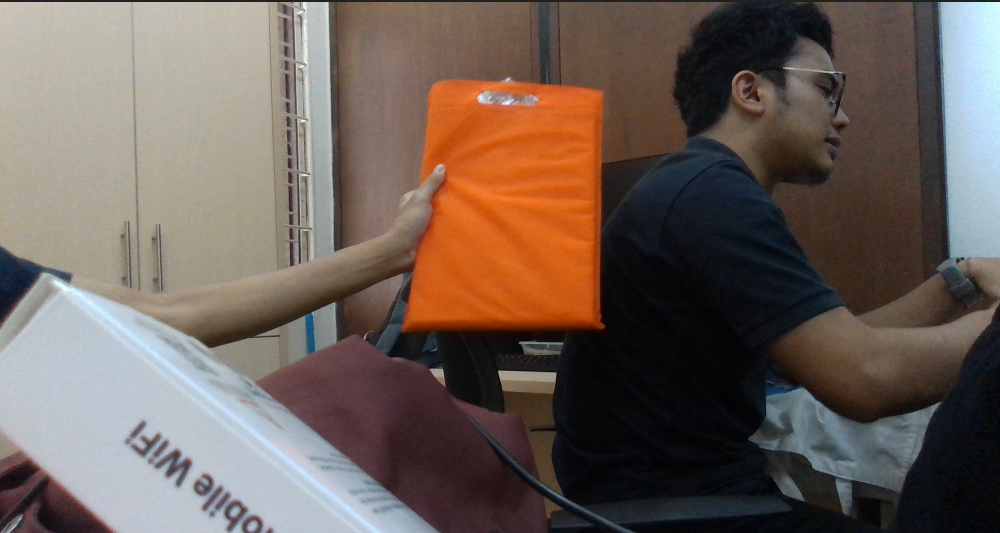
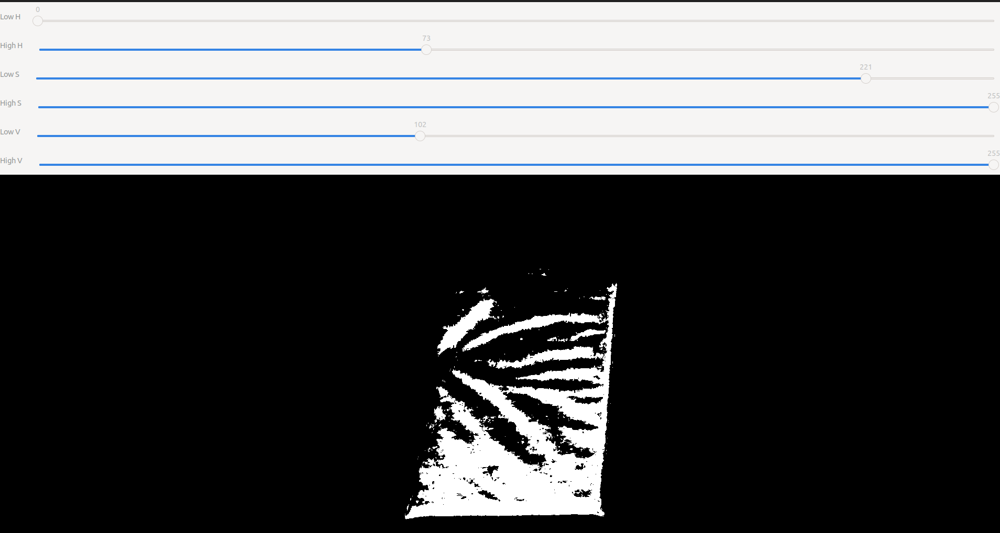

# MSD700 'Follower' Package

## Prerequisite

1. Installed [ROS](http://wiki.ros.org/ROS/Installation). In this project, we use [ROS Noetic](http://wiki.ros.org/noetic/Installation) distribution.
2. Installed [rosserial_arduino](http://wiki.ros.org/rosserial_arduino). With this package we can connect our machine with Arduino and communicate with it using ROS.
3. Installed [Git](https://git-scm.com/downloads).

## Instal `rosserial_arduino`

If you haven't installed `rosserial_arduino`, here are the step to install it.  
Open the terminal and run the following command.
```bash
sudo apt-get install ros-$ROS_DISTRO-rosserial-arduino
sudo apt-get install ros-$ROS_DISTRO-rosserial
```
For our development, because we use ROS Noetic the command that we use are 
```bash
sudo apt-get install ros-noetic-rosserial-arduino
sudo apt-get install ros-noetic-rosserial
```
  
After installing `rosserial` for our machine, we installed `rosserial` arduino library. 
1. Open the Arduino IDE, in this case we use Arduino IDE 1.8.19 but this may work in other version as well.
2. Open **Sketch** tab then select **Include Library** and click **Manage Libraries**.
3. This will open **Library Manager** Window. Search for **rosserial** and install the library.


# How to Use

## 1. Setup the ROS Package

1. Go to your local ROS workspace. For example:
``` bash
cd ~/catkin_ws/src
```
2. Clone the repository
``` bash
git clone https://github.com/itbdelaboprogramming/follower.git
```
3. Make the ROS workspace, type `catkin_make` into the terminal and run it.
``` bash
catkin_make
```

## 2. Setup the Arduino Board

1. Run the ROS Environment
``` bash
roscore
```
2. Go to your Arduino libraries directory and remove the ros_lib folder if it already exist.
``` bash
cd <sketchbook>/libraries
rm -rf ros_lib
```
3. Open a new terminal an create a new ros_lib. A new folder named `ros_lib` should appear in your Arduino Libraries directory.
``` bash
rosrun rosserial_arduino make_libraries.py .
```
4. Go back to the `follower` directory and go to the Arduino folder.
``` bash
cd ~/catkin_ws/src/follower/Arduino/test_custom_ros_msg
```
5. Open the Arduino sketch with Arduino IDE and upload it to your board.
``` bash
arduino test_custom_ros_msg
```

## 3. Run the Package
Launch the node by run this command in terminal
``` bash
roslaunch follower follower.launch
```

# Read more
### This program uses Python's OOP concepts with the main Program is `follow_me.py`.

#### The main program will import Class `DeviceCamera` from :
```bash
~/scripts/device_camera.py
```
When initialize the class `DeviceCamera()` is better to define the id device for the camera, for example `DeviceCamera(4)`. If you are using other cameras besides realsense, you need to redifine the class to false, for example `DeviceCamera(4, False)`.

#### import Class `ObjectTracker` from :
```bash
~/scripts/tracker.py
```
Using the `ObjectTracker` class you can choose from the available tracking methods. There are 7 tracker algorithms that can be used, which are:
    1. Boosting
    2. CSRT
    3. KCF
    4. Median Flow
    5. MIL
    6. MOSSE
    7. TLD

You need to define which algorithm you will use base on their number when initialize this class in the main program (`follow_me.py`), for example `tracker = ObjectTracker(4)`. We already try algorithm number 4 and it goes well so far. There will be update for other algorithm info in the future.

#### import Class `DarknetDNN` from :
```bash
~/scripts/darknet_yolo.py
```
`DarknetDNN` designed for performing object detection using the Darknet framework and OpenCV. It's a versatile tool for identifying objects in a video stream, with a focus on customizable configurations and real-time feedback.

In the main program (`follow_me.py`) class `DarknetDNN` is define by `net` variable. It will call `set_hsv_range(low_hsv, high_hsv)` and `set_color_threshold(value)` function. You can customize the hsv range with `set_hsv_range(low_hsv, high_hsv)` function. To set the minimum color confidence required for an object to be considered relevant, you can set parameter `value` in `set_color_threshold`. Objects with color confidence below this threshold will not be included in the final result.

#### `hsvtunner.py` is a program to calibrate the lower and upper limit values of hsv.
you can run this program to find out the lower limit and upper limit of the hsv value of a color that you want. Type this code in your terminal:
```bash
cd ~/follower/src/scripts
```
then run the code
```bash
python hsvtunner.py --camera `your camera device number`
```
for example if the camera device number is 4
```bash
python hsvtunner.py --camera 4
```
if the program run perfectly you will see 2 different camera views. One is the normal camera, and the other is the HSV filtered view result. You can adjust value for lower limit and upper limit of the hsv value until the collor that you want will be displayed by the filter camera in white while other colors will be black.

|            Normal Camera             |              HSV Filter              |
|:------------------------------------:|:------------------------------------:|
|   ||


# ROS Nodes For the main program (`follow_me.py`)

### Initialization:
Initializes a ROS node named `follow_me_node` for this module to interact within the ROS ecosystem.

### Publishers:
`rover_command`: Sends commands related to the rover's behavior. Messages of type `TargetState` are published on this topic.
`cmd_vel`: Provides velocity control commands for the rover. Messages of type `Twist` are published on this topic.

### Parameters:
`max_speed`: Represents the maximum linear speed of the rover. (float, Default value: 1.0 m/s)
`max_turn`: Defines the maximum turning rate of the rover. (float, Default value: 0.8 rad/s)
`target_dist`: Specifies a target distance parameter, likely related to the rover's behavior. (float, Default value: 2.0 meters)